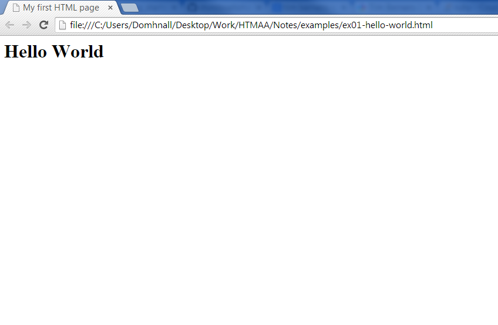

# In the beginning was the net

A loosely organised collection of computers where you could email someone, but where the idea of a website - like twitter.com - was still far removed. By the end of this chapter you should know enough `HTML` to build a very basic user interface. 

### Scientists were on the web before it was cool. #Hipsters

The developers of the worlds first system of formatting information for dispaly on a screen and then linking those documents together were not employed by any software company or hardware manufacturer. Rather they were researchers at CERN, one of the most renowned labs in the world where necessity gave birth to the idea that would ultimately become known as  the world wide web. Their development - Hypertext Markup Language - allowed them to share and link research documents with speed and ease. Information flowed quickly across the fledgling internet and any academic with access to a computer terminal now had access to their work.  

## HTML 

> "Innovation is serendipity, so you don't know what people will make."
> ~Sir Tim Berners-Lee

Hypertext Markup Language (HTML) is a system for "marking up" a document. What does this mean? Well, it gives the data a context that a browser can understand. The concept of a HTML tag is not too far removed from the idea of using quotation marks in a piece of text. If you want to signify that someone has said something you surround it in quotation marks, such as "To be or not to be?" or the quote from Tim Berners-Lee above. These symbols have special meaning for human readers as they imply that those specific words have been spoken out loud. Similarly, HTML uses a system of tags to confer meaning to information. It is from those tags the browser understands what it should do with that information. 

## Markup Tags

The majority of tags that you will encounter are like quotation marks in that there are opening tags and closing varieties. A HTML tag is any word that is surrounded by brackets like so: `<tagName>`. A closing tag differs slightly in that the tag name is preceeded by a forward slash like this: `</tagName>`. Here's a quick example to try which creates a very simple page with the words "Hello World" in big letters.

<code data-gist-id="b362490ab6fb7d332aeb"></code>
    
<a href="http://bl.ocks.org/domhnallohanlon/raw/ba92975e504d2cebd3c9/" class="text-success pull-right" target="_blank" role="button">Preview Example</a> 
<a href="https://gist.github.com/domhnallohanlon/ba92975e504d2cebd3c9/download" class="text-success pull-right">Download Code</a> 

<!-- The page above should look like the image below.

 -->

Let's take a look at this example in a bit more detail. The first and last line are for the opening and closing `<html>` tags. This tells the web browser that all the code it is about to read should be formatted as HTML code. 
Next there are two sections that every page should have. The `<head>` and the `<body>`. 

The __head__ section contains information about the page, such as what information should appear in the title bar (specified inside the`<title>` tags) as well as how the pages should be styled, how it should be rendered on different screensizes and what information will be displayed by Search Engines. We will address all of these topics in a later section. The `<head>` section begins on line 2 and end on line 4 in our example above.

The __body__ section contains the information that should be displayed on the page itself. In our example above the `<body>` begins on line 5 and ends on line 7. In this case we have only displayed the message "Hello World" on our page. You will notice that is it surrounded by `<h1>` tags. 

## Headings

In HTML 'h' is shorthand for 'heading' so `<h1>` is the biggest heading. Here are a few more example - you should try them out for your self.

HTML Tag    | Output
:----------:|:----------:
`<h1>heading 1</h1>`   |  <h1> heading 1</h1>
`<h2>heading 2</h2>`   |  <h1 class="h2"> heading 2</h1>
`<h3>heading 3</h3>`   |  <h3> heading 3</h3>
`<h4>heading 4</h4>`   |  <h4> heading 4</h4>
`<h5>heading 5</h5>`   |  <h5> heading 5</h5>
`<h6>heading 6</h6>`   |  <h6> heading 6</h6>

## Text
Wheter you want to display prose or source code, there's an HTML tag to suit your needs. This section takes you through the tags you need to display text, quotes and code. In the <a href="#Lists">next section</a> we'll cover a few different way of presenting text in a list format.

### Paragraphs
While it is possible to simply type text into a .html document and have it displayed by a browser this is not best practice. Whenever you have a some text or paragraphs to display on your page the best tag to use is the `
` tag. The opening tag denotes the beginning of the paragraph and the closing tag, `
` marks the end of the paragraph.

### Quotations
In printed publications such as magazines or newspapers, the editors will pull snippets of memorable or important information out of the article and highlight it as a quote. In HTML this can be achieved with a pair of `<blockquote> </blockquote>` tags. As you've come to expect by now, anything between the opening and closing tags will be markedup by the browser as a quotation.

### Code
For more technical articles, such as the ones on this site, it is often useful to include some example code to support what you are taking about. The question here is, how to you write the name of a tag that you're talking about without the browser simply interpreting it as a tag? At the most basic you can use the ANSI values for your opening and closing brackets. For example the opening bracket (which is also a "less-than" symbol in mathematics) has the code `&lt;` and a closing bracket (or "greater-than" symbol) has the code `&gt;`. This means that for something as simple as a heading `<h1> main heading </h1>` you end up having to code `&lt;h1&gt; main heading &lt;/h1&gt;`. Now, maybe that's not too bad to one or two tags, but to replicate a whole webpage there surely has to be a better way - and surely there is! 
A pair of `<code> </code>` tags will just display everything typed between them on the page, rather than having the browser try to display the actaul tabs.
See also: <Verbatim>
## Lists

<code data-gist-id="be335a12f1e908fd74c4"></code>

<a href="http://bl.ocks.org/domhnallohanlon/raw/09bdd8a562a8f311a14b/" class="text-success pull-right" target="_blank">Preview Example</a>  

<a href="https://gist.github.com/domhnallohanlon/be335a12f1e908fd74c4/download" class="text-success pull-right">Download Code</a> 

## Images

The image tag, `` is our first example of a self-closing tag, which means that there is no closing image tag. This makes sense since you typically wouldn't want to display text as an image, rather you would like to tell the web browser what image file it should display. 

### Attributes
The image tag is a good opportunity to introduce the concept of _attributes_. To display any image on screen we have to tell the image tag exactly which image file we want it to display. Files can be stored locally or on a remote server but in either case you have to specify the _source_ of the image. This is done by including a `src` attribute:
`` 

Please note the _value_ you give the `src` arrtibute must be the exact path to the file. The full location is written between the opening and closing quotation marks. If we want to display an image called phone.png, which is in the same directory as our HTML file then we'd type:
``

It is also considered best practice to include an `alt` tag. This attribute specifies the alternative text that should be displayed in the event that the image can not be displayed. You should try to make your alt text as descriptive as possible as it is also the information that is read by screen readers for people who have visual impairments. Using the phone example.

``

In the sample code below you will notice that I have used a `height` attribute, which allows us to specify how tall the image should be. Similarly there is also a `width` tag, which tells the browser how wide the image should be on the screen. It is not generally considered best practice to resize images in this manner, but I have done it for the sake of introducing a few more attributes and because it makes the <a href="http://bl.ocks.org/domhnallohanlon/raw/9f9eeae17a26e2a3ba61/" target="_blank">preview </a> look better.

### Sample Code

The code snippet below uses a local image and two remote images to demonstrate how images can be include in an HTML document.

<!-- gist with html only, no .png file -->
<code data-gist-id="dd0b15e0e80894044620"></code>

<a href="http://bl.ocks.org/domhnallohanlon/raw/9f9eeae17a26e2a3ba61/" class="text-success pull-right" target="_blank">Preview Example</a>
<a href="https://gist.github.com/9f9eeae17a26e2a3ba61/domhnallohanlon/download" class="text-success pull-right">Download Code</a> 

## Links

To link different pages together use a set of anchor tags ``. The anchor tag allows you to link to external pages on the web, other pages on your site or just another section within your pages

### Attributes

A you'd probably expect, the `<a>` tag need to know which page to open. This value is specified via the _hyperreference_ attribute. Note that when linking to a document on the web you should specify the protocol to use, such as `http://` or `https://`. To open the Google homepage you would use the following:
`<a href="http://google.com">Go To Google</a>`

If you try this in your own page you might notice that the page will open in that same tab as the one you already had open. To have a link open in a new tab simply use the _target_ attribute:
`<a href="http://google.com" target="_blank">Open Google in a new window</a>`
The `_blank` value is a reserved value that is used by web browsers to indicate that a new window or tab should be opened.  

## Sections

Often when you are designing a page or app you will need to group several elements together, for example a menu at the top or side of the page, or perhaps a selection of thhumbnails if you are making an image gallery app.
In cases such as this the `
` tag is your friend

### 

A DIV is what is known as a block element in HTML. The div tag is a sub-division (div-ision?) of a page where other elements can easily be grouped together. Just like most tags a div begins with an opening tag `
` and ends with a closing tag `
`. The useful thing about DIVs is that they can be styled with CSS, and when given their own ID or Class attribute you can acheive a high amount of control of where elements are positioned on your page and how they appear.

### 
Another block element that can be positioned as you require is the `span` tag. These are frequently used to style individual symbols or characters on the screen and we'll see more of these as when we're working with third-party fonts and icons.

## Summary