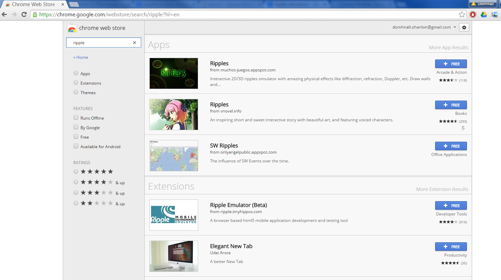
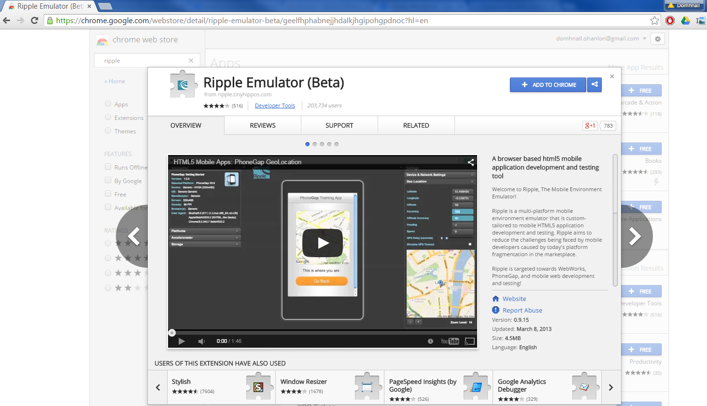
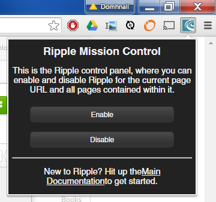
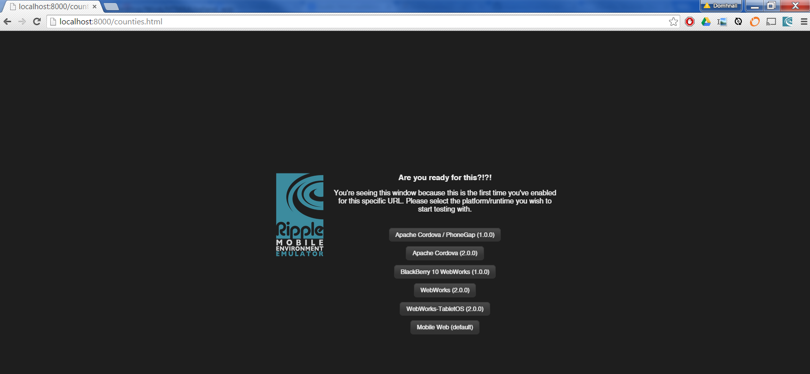
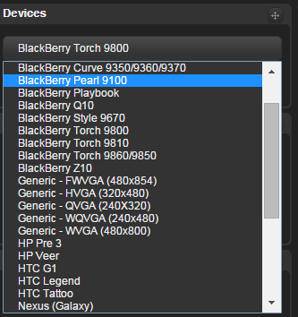
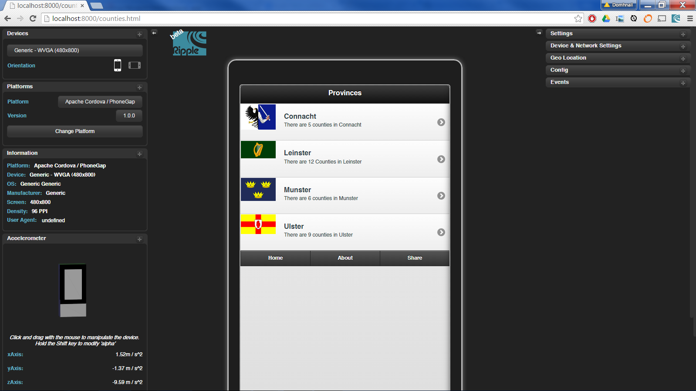
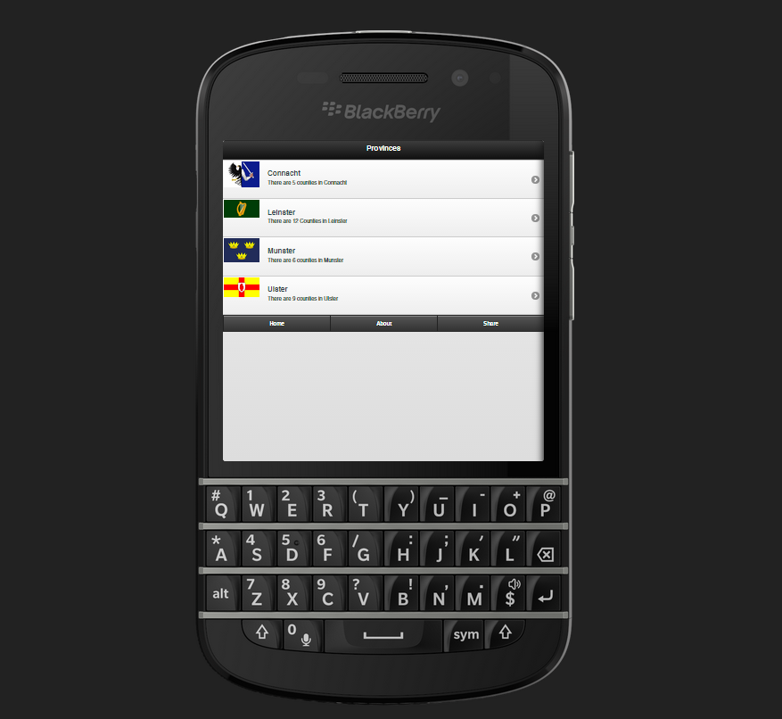
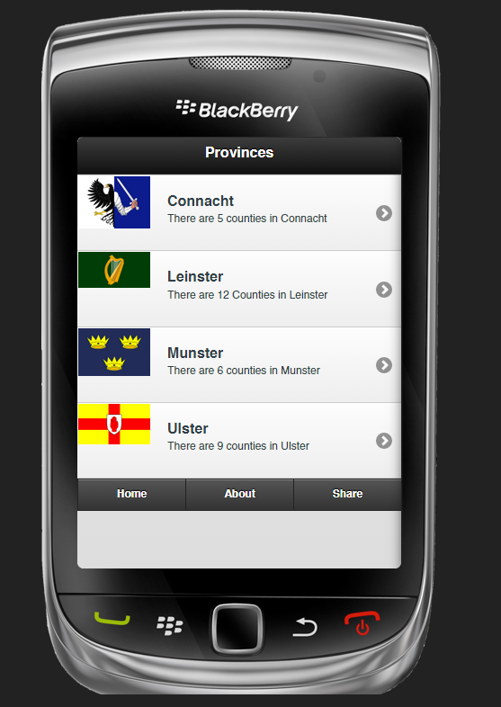
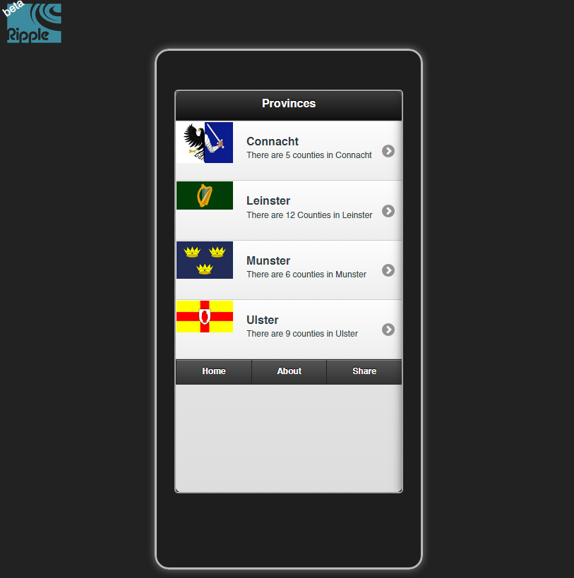
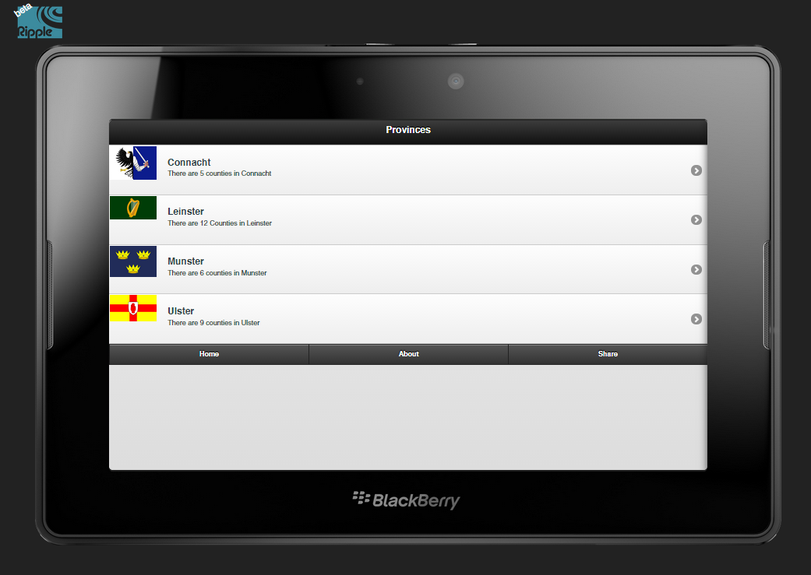

# Emulating with Ripple

Ripple is part of a suit of development tools called <a href="http://developer.blackberry.com/html5/download/ripple/">WebWorks</a> developed by BalckBerry.
You can use the Ripple emulator in the Chrome Browser using <a href="https://chrome.google.com/webstore/detail/ripple-emulator-beta/geelfhphabnejjhdalkjhgipohgpdnoc?hl=en">this extension</a>

## Install

The first step is to find the extension in the Chrome store and add it to your browser.

## Run

Once you are running your app from an HTTP server you can choose to view it in the Ripple emulator by clicking on the ripple icon and selecting *Enable*.
The first time your run Ripple you have to select which platform you want to choose for emulation. This can be changed again later if you wish.

## Test

Once the emulator is running you can choose your target device in the menu on the right.

